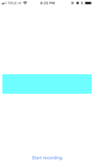
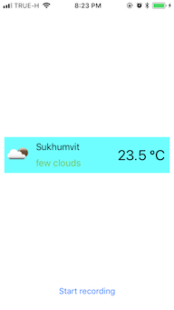

# iOS Coding Challenge
## How to use an app
- Build and run an app on the device from the xCode
- On the app start screen tap on Start recording button.

- Say something that contains "weather" word (e.g. "current weather")
- Wait for the result

